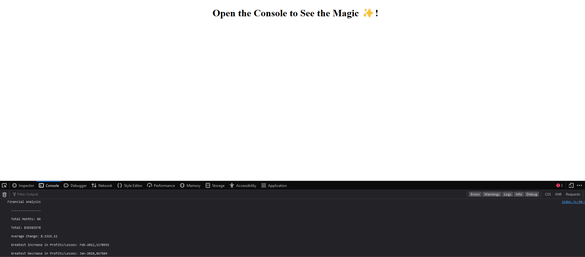

# Console Finances

# Description

Console application performing several functions on an array of financial information.
 
# Installation

Open the link in a modern browser (Tested on Firefox and Chrome): (https://therandommer.github.io/Console-Finances/)
Open your browsers console to view the functionality of this application!

Firefox and Chrome controls to access the console interface:

Either

Right Click -> Inspect and navigate to the console in the window.
Press F11 to open the console window

# Usage

When you open the site in your browser you should see a site that looks like the screenshots in the below:

## Desktop

## License

Using MIT License.